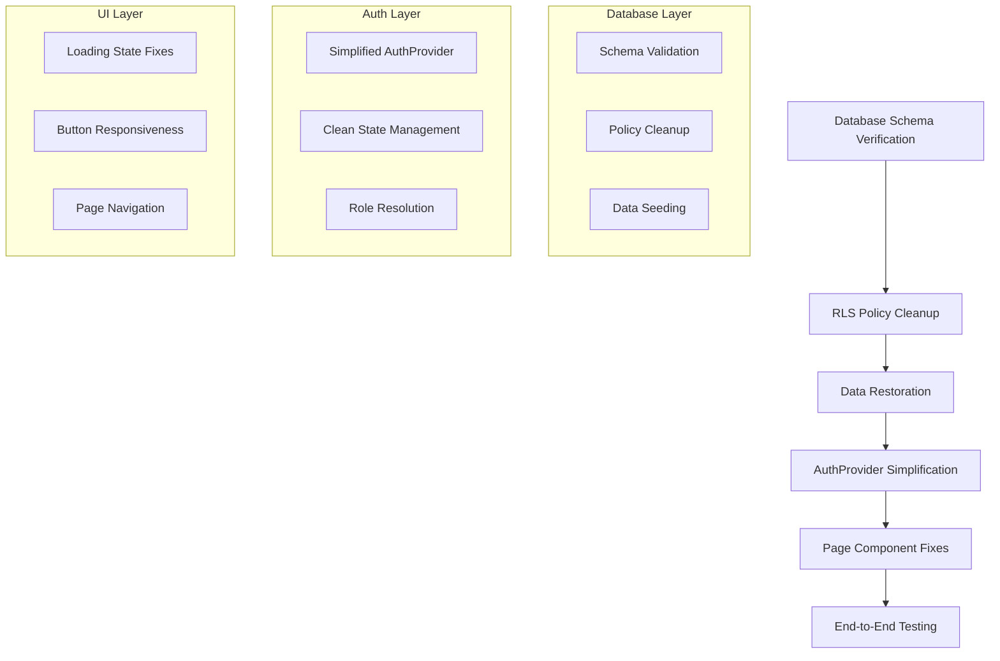

# Design Document

## Overview

This design document outlines the systematic approach to fix critical issues in the Career Guidance Project. The application currently suffers from infinite loading states, authentication loops, broken RLS policies, and missing data. The fix strategy follows a methodical approach: verify database schema, fix authentication logic, repair RLS policies, restore data, and validate all user flows.

## Architecture

### Current Issues Analysis

Based on code analysis, the main problems are:

1. **AuthProvider Complexity**: The AuthProvider uses Zustand store with persistence, refs to prevent re-initialization, and complex dependency chains that can cause infinite loops
2. **RLS Policy Conflicts**: Multiple policies may be conflicting or overly restrictive
3. **Missing Data**: Weeks table appears empty, preventing frontend display
4. **State Management**: Complex interaction between Zustand store persistence and React context

### Fix Strategy Architecture



## Components and Interfaces

### 1. Database Schema Verification

#### Schema Validation Process
- Pull current schema using `supabase db pull`
- Compare against expected schema in `sql/init.sql`
- Generate migration SQL for any mismatches
- Apply migrations to align database structure

#### Expected Schema Validation
```sql
-- Verify core tables exist with correct structure
SELECT table_name, column_name, data_type, is_nullable
FROM information_schema.columns 
WHERE table_schema = 'public' 
AND table_name IN ('profiles', 'weeks', 'groups', 'week_files', 'group_members', 'group_messages');
```

### 2. RLS Policy Cleanup

#### Policy Analysis Strategy
- List all existing RLS policies for each table
- Identify duplicate or conflicting policies
- Remove problematic policies
- Apply clean, minimal policy set

#### Clean Policy Implementation
```sql
-- Example of clean, minimal policies
-- Profiles: Public read, own update
DROP POLICY IF EXISTS "duplicate_profile_policy" ON profiles;
CREATE POLICY "profiles_select" ON profiles FOR SELECT USING (true);
CREATE POLICY "profiles_update" ON profiles FOR UPDATE USING (auth.uid() = id);

-- Weeks: Public read, admin write
CREATE POLICY "weeks_select" ON weeks FOR SELECT USING (true);
CREATE POLICY "weeks_admin_write" ON weeks FOR ALL USING (
  EXISTS (SELECT 1 FROM profiles WHERE id = auth.uid() AND role = 'admin')
);
```

### 3. AuthProvider Simplification

#### Current Issues
- Complex Zustand store with persistence causing hydration issues
- Multiple refs and callbacks creating dependency loops
- Over-engineered state management for auth needs

#### Simplified Design
```typescript
interface AuthContextType {
  user: User | null;
  role: string | null;
  isLoading: boolean;
  signIn: (email: string, password: string) => Promise<AuthResult>;
  signOut: () => Promise<void>;
}

// Simplified implementation without Zustand store
export function AuthProvider({ children }: { children: React.ReactNode }) {
  const [user, setUser] = useState<User | null>(null);
  const [role, setRole] = useState<string | null>(null);
  const [isLoading, setIsLoading] = useState(true);
  
  // Single useEffect for initialization
  useEffect(() => {
    let mounted = true;
    
    const initAuth = async () => {
      const { data: { session } } = await supabase.auth.getSession();
      if (!mounted) return;
      
      if (session?.user) {
        setUser(session.user);
        const userRole = await fetchUserRole(session.user.id);
        setRole(userRole);
      }
      setIsLoading(false);
    };
    
    initAuth();
    
    const { data: { subscription } } = supabase.auth.onAuthStateChange(
      async (event, session) => {
        if (!mounted) return;
        
        if (event === 'SIGNED_IN' && session?.user) {
          setUser(session.user);
          const userRole = await fetchUserRole(session.user.id);
          setRole(userRole);
        } else if (event === 'SIGNED_OUT') {
          setUser(null);
          setRole(null);
        }
      }
    );
    
    return () => {
      mounted = false;
      subscription.unsubscribe();
    };
  }, []); // No dependencies to prevent loops
  
  // ... rest of implementation
}
```

### 4. Data Restoration Strategy

#### Weeks Data Seeding
- Check if weeks table is empty
- Upload files from `csp/Week1-Week5` to Supabase storage
- Create week records with proper file references
- Verify file accessibility and permissions

#### File Upload Process
```typescript
const seedWeeksData = async () => {
  for (let i = 1; i <= 5; i++) {
    const weekPath = `csp/Week${i}`;
    
    // Upload photos
    const photos = await uploadPhotos(weekPath);
    
    // Upload PDF
    const pdf = await uploadPDF(weekPath);
    
    // Create week record
    await supabase.from('weeks').insert({
      week_number: i,
      title: `Week ${i}`,
      description: `Content for week ${i}`,
    });
    
    // Link files to week
    await linkFilesToWeek(weekId, [...photos, pdf]);
  }
};
```

### 5. Page Component Fixes

#### Loading State Management
- Remove complex loading logic from components
- Use simple auth context values
- Implement proper loading boundaries

#### Button Responsiveness
- Ensure buttons are not disabled by auth loading states
- Add proper error handling for user actions
- Implement optimistic UI updates where appropriate

## Data Models

### Simplified Auth State Model

```typescript
interface AuthState {
  user: User | null;
  role: 'admin' | 'student' | null;
  isLoading: boolean;
}

// No persistence, no complex store - just React state
```

### Database Verification Model

```typescript
interface SchemaCheck {
  table: string;
  exists: boolean;
  columns: ColumnInfo[];
  policies: PolicyInfo[];
  issues: string[];
}

interface FixPlan {
  schemaFixes: string[];
  policyFixes: string[];
  dataSeeding: SeedingTask[];
}
```

## Error Handling

### Database Connection Issues
- Verify Supabase connection parameters
- Test basic connectivity before proceeding
- Provide clear error messages for connection failures

### Authentication Failures
- Handle network timeouts gracefully
- Provide user-friendly error messages
- Implement retry logic for transient failures

### File Upload Errors
- Validate file types and sizes before upload
- Handle storage quota issues
- Provide progress feedback for large uploads

## Testing Strategy

### Systematic Testing Approach

#### 1. Database Verification Tests
```bash
# Test database connectivity
supabase status
supabase db pull --schema public

# Verify table structure
psql -h localhost -p 54322 -U postgres -d postgres -c "\d+ profiles"
```

#### 2. Authentication Flow Tests
```typescript
// Test simplified auth flow
describe('AuthProvider', () => {
  it('should initialize without infinite loops', async () => {
    render(<AuthProvider><TestComponent /></AuthProvider>);
    
    // Should not have multiple re-renders
    expect(mockUseEffect).toHaveBeenCalledTimes(1);
  });
  
  it('should resolve user role correctly', async () => {
    // Mock successful auth
    mockSupabase.auth.getSession.mockResolvedValue({
      data: { session: mockSession }
    });
    
    render(<AuthProvider><TestComponent /></AuthProvider>);
    
    await waitFor(() => {
      expect(screen.getByText('admin')).toBeInTheDocument();
    });
  });
});
```

#### 3. End-to-End Flow Tests
```typescript
// Test complete user journeys
describe('User Flows', () => {
  it('student flow: login → view weeks → join group → chat', async () => {
    // Login as student
    await loginAsStudent();
    
    // Navigate to weeks
    await navigateToWeeks();
    expect(screen.getByText('Week 1')).toBeInTheDocument();
    
    // Join group
    await joinGroup('Test Group');
    
    // Send chat message
    await sendChatMessage('Hello world');
    expect(screen.getByText('Hello world')).toBeInTheDocument();
  });
  
  it('admin flow: login → create week → manage groups', async () => {
    // Login as admin
    await loginAsAdmin();
    
    // Create new week
    await createWeek({
      title: 'New Week',
      photos: ['photo1.jpg'],
      pdf: 'content.pdf'
    });
    
    // Verify week appears
    expect(screen.getByText('New Week')).toBeInTheDocument();
  });
});
```

### Performance Testing
- Measure page load times before and after fixes
- Verify no memory leaks in auth state management
- Test real-time chat performance with multiple users

### Regression Testing
- Ensure existing functionality still works after fixes
- Test edge cases like network interruptions
- Verify mobile responsiveness is maintained

## Implementation Phases

### Phase 1: Database Foundation (Requirements 1, 3, 4)
1. Verify and fix database schema
2. Clean up RLS policies
3. Restore weeks data from csp/ folder
4. Test database connectivity and permissions

### Phase 2: Authentication Fixes (Requirement 2)
1. Simplify AuthProvider implementation
2. Remove Zustand store complexity
3. Fix infinite loop issues
4. Remove debug components

### Phase 3: UI Fixes (Requirement 5)
1. Fix loading states in page components
2. Ensure buttons are responsive
3. Fix navigation between pages
4. Remove suspended states

### Phase 4: Feature Validation (Requirements 6, 7, 8)
1. Test student user flows
2. Test admin user flows
3. Verify AskAI functionality
4. Test real-time chat features

### Phase 5: End-to-End Verification (Requirement 9)
1. Run complete user journey tests
2. Verify no infinite loading or crashes
3. Test all authentication scenarios
4. Performance and stability validation

## Success Criteria

### Technical Metrics
- Page load time < 2 seconds
- No infinite re-renders in React DevTools
- All database queries execute successfully
- Zero authentication errors in console

### Functional Metrics
- All user flows complete without errors
- Real-time chat works with multiple users
- File uploads and downloads work correctly
- Admin features are properly protected

### User Experience Metrics
- No loading spinners that never resolve
- Buttons respond immediately to clicks
- Smooth navigation between pages
- Clear error messages when issues occur