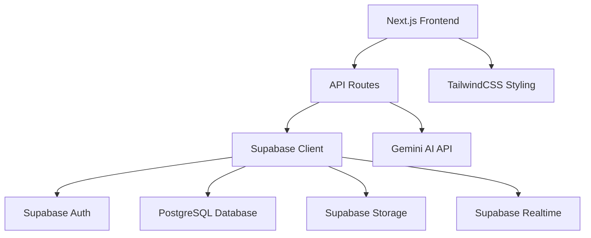

# Design Document

## Overview

The Career Guidance Project Website is a full-stack web application built with Next.js, featuring a React frontend with TailwindCSS styling and Node.js API routes for backend functionality. The application uses Supabase as the backend-as-a-service platform, providing authentication, PostgreSQL database, file storage, and real-time capabilities. The design follows a modular, component-based architecture with clear separation of concerns and implements a liquid glass aesthetic for modern UI appeal.

## Architecture

### High-Level Architecture



### Technology Stack

- **Frontend Framework**: Next.js 14+ with React 18+
- **Styling**: TailwindCSS with liquid glass design system
- **Backend**: Next.js API Routes (Node.js)
- **Database**: Supabase PostgreSQL with Row-Level Security
- **Authentication**: Supabase Auth
- **File Storage**: Supabase Storage
- **Real-time**: Supabase Realtime subscriptions
- **AI Integration**: Google Gemini API via `@google/generative-ai`
- **Testing**: Jest + React Testing Library
- **Deployment**: Vercel

### Folder Structure

```
/
├── components/
│   ├── ui/
│   │   ├── Button.tsx
│   │   ├── Modal.tsx
│   │   ├── Sidebar.tsx
│   │   └── InfoBox.tsx
│   ├── layout/
│   │   ├── Layout.tsx
│   │   └── Navigation.tsx
│   ├── features/
│   │   ├── HomePage/
│   │   ├── WeeksPage/
│   │   ├── GroupsPage/
│   │   ├── AdminPage/
│   │   └── AskAI/
│   └── common/
├── pages/
│   ├── api/
│   │   ├── weeks/
│   │   ├── groups/
│   │   ├── admin/
│   │   └── askai.ts
│   ├── index.tsx
│   ├── weeks.tsx
│   ├── groups.tsx
│   ├── admin.tsx
│   └── _app.tsx
├── lib/
│   ├── supabase.ts
│   ├── auth.ts
│   ├── database.ts
│   └── utils.ts
├── tests/
│   ├── components/
│   ├── pages/
│   ├── api/
│   └── lib/
├── sql/
│   └── init.sql
└── public/
```

## Components and Interfaces

### Core Components

#### Layout Components
- **Layout.tsx**: Main application wrapper with sidebar and navigation
- **Sidebar.tsx**: Collapsible navigation sidebar with route management
- **Navigation.tsx**: Top navigation bar with user controls

#### UI Components
- **InfoBox.tsx**: Reusable statistics display component with click handlers
- **Modal.tsx**: Generic modal component for content display
- **Button.tsx**: Styled button component with variants
- **FileViewer.tsx**: Component for displaying PDFs, images, and videos

#### Feature Components
- **HomePage**: Statistics dashboard with interactive info boxes
- **WeeksPage**: Week listing and content modal display
- **GroupsPage**: Real-time group chat interface
- **AdminPage**: Content upload and user management interface
- **AskAI**: AI chatbot popup and fullscreen interface

### API Interfaces

#### Authentication Endpoints
- `POST /api/auth/login` - User authentication
- `POST /api/auth/signup` - User registration
- `POST /api/auth/logout` - User logout

#### Content Management Endpoints
- `GET /api/weeks` - Fetch all weeks
- `GET /api/weeks/[id]` - Fetch specific week with files
- `POST /api/weeks` - Create new week (admin only)
- `POST /api/weeks/[id]/files` - Upload files to week

#### Group Chat Endpoints
- `GET /api/groups` - Fetch user's groups
- `POST /api/groups/[id]/messages` - Send group message
- `GET /api/groups/[id]/messages` - Fetch group messages

#### Admin Endpoints
- `GET /api/admin/requests` - Fetch pending admin requests
- `POST /api/admin/requests/[id]/approve` - Approve admin request
- `POST /api/admin/requests/[id]/deny` - Deny admin request

#### AI Integration
- `POST /api/askai` - Proxy requests to Gemini API

## Data Models

### Database Schema

```sql
-- User profiles with role-based access
CREATE TABLE profiles (
  id UUID REFERENCES auth.users ON DELETE CASCADE PRIMARY KEY,
  email TEXT UNIQUE NOT NULL,
  full_name TEXT,
  role TEXT DEFAULT 'student' CHECK (role IN ('student', 'admin')),
  created_at TIMESTAMP WITH TIME ZONE DEFAULT NOW(),
  updated_at TIMESTAMP WITH TIME ZONE DEFAULT NOW()
);

-- Schools visited during the program
CREATE TABLE schools (
  id UUID DEFAULT gen_random_uuid() PRIMARY KEY,
  name TEXT NOT NULL,
  location TEXT,
  visit_date DATE,
  created_at TIMESTAMP WITH TIME ZONE DEFAULT NOW()
);

-- Team members information
CREATE TABLE team_members (
  id UUID DEFAULT gen_random_uuid() PRIMARY KEY,
  name TEXT NOT NULL,
  roll_number TEXT UNIQUE,
  position TEXT,
  created_at TIMESTAMP WITH TIME ZONE DEFAULT NOW()
);

-- Weekly content organization
CREATE TABLE weeks (
  id UUID DEFAULT gen_random_uuid() PRIMARY KEY,
  week_number INTEGER UNIQUE NOT NULL,
  title TEXT NOT NULL,
  description TEXT,
  created_by UUID REFERENCES profiles(id),
  created_at TIMESTAMP WITH TIME ZONE DEFAULT NOW()
);

-- Files associated with weeks
CREATE TABLE week_files (
  id UUID DEFAULT gen_random_uuid() PRIMARY KEY,
  week_id UUID REFERENCES weeks(id) ON DELETE CASCADE,
  file_name TEXT NOT NULL,
  file_type TEXT NOT NULL CHECK (file_type IN ('photo', 'video', 'pdf')),
  file_url TEXT NOT NULL,
  file_size BIGINT,
  uploaded_by UUID REFERENCES profiles(id),
  created_at TIMESTAMP WITH TIME ZONE DEFAULT NOW()
);

-- Group chat functionality
CREATE TABLE groups (
  id UUID DEFAULT gen_random_uuid() PRIMARY KEY,
  name TEXT NOT NULL,
  description TEXT,
  created_by UUID REFERENCES profiles(id),
  created_at TIMESTAMP WITH TIME ZONE DEFAULT NOW()
);

-- Group membership
CREATE TABLE group_members (
  id UUID DEFAULT gen_random_uuid() PRIMARY KEY,
  group_id UUID REFERENCES groups(id) ON DELETE CASCADE,
  user_id UUID REFERENCES profiles(id) ON DELETE CASCADE,
  joined_at TIMESTAMP WITH TIME ZONE DEFAULT NOW(),
  UNIQUE(group_id, user_id)
);

-- Group messages with real-time support
CREATE TABLE group_messages (
  id UUID DEFAULT gen_random_uuid() PRIMARY KEY,
  group_id UUID REFERENCES groups(id) ON DELETE CASCADE,
  sender_id UUID REFERENCES profiles(id) ON DELETE CASCADE,
  message TEXT NOT NULL,
  created_at TIMESTAMP WITH TIME ZONE DEFAULT NOW()
);

-- AI chat conversations with auto-expiry
CREATE TABLE ai_chats (
  id UUID DEFAULT gen_random_uuid() PRIMARY KEY,
  user_id UUID REFERENCES profiles(id) ON DELETE CASCADE,
  message TEXT NOT NULL,
  response TEXT NOT NULL,
  created_at TIMESTAMP WITH TIME ZONE DEFAULT NOW(),
  expires_at TIMESTAMP WITH TIME ZONE DEFAULT (NOW() + INTERVAL '30 days')
);

-- Admin role requests
CREATE TABLE admin_requests (
  id UUID DEFAULT gen_random_uuid() PRIMARY KEY,
  user_id UUID REFERENCES profiles(id) ON DELETE CASCADE,
  reason TEXT,
  status TEXT DEFAULT 'pending' CHECK (status IN ('pending', 'approved', 'denied')),
  reviewed_by UUID REFERENCES profiles(id),
  created_at TIMESTAMP WITH TIME ZONE DEFAULT NOW(),
  reviewed_at TIMESTAMP WITH TIME ZONE
);
```

### Row-Level Security Policies

```sql
-- Enable RLS on all tables
ALTER TABLE profiles ENABLE ROW LEVEL SECURITY;
ALTER TABLE weeks ENABLE ROW LEVEL SECURITY;
ALTER TABLE week_files ENABLE ROW LEVEL SECURITY;
ALTER TABLE groups ENABLE ROW LEVEL SECURITY;
ALTER TABLE group_members ENABLE ROW LEVEL SECURITY;
ALTER TABLE group_messages ENABLE ROW LEVEL SECURITY;
ALTER TABLE ai_chats ENABLE ROW LEVEL SECURITY;
ALTER TABLE admin_requests ENABLE ROW LEVEL SECURITY;

-- Profiles: Users can read all profiles, update their own
CREATE POLICY "Public profiles are viewable by everyone" ON profiles FOR SELECT USING (true);
CREATE POLICY "Users can update own profile" ON profiles FOR UPDATE USING (auth.uid() = id);

-- Weeks: Everyone can read, only admins can create/update
CREATE POLICY "Weeks are viewable by everyone" ON weeks FOR SELECT USING (true);
CREATE POLICY "Only admins can create weeks" ON weeks FOR INSERT WITH CHECK (
  EXISTS (SELECT 1 FROM profiles WHERE id = auth.uid() AND role = 'admin')
);

-- Week files: Everyone can read, only admins can upload
CREATE POLICY "Week files are viewable by everyone" ON week_files FOR SELECT USING (true);
CREATE POLICY "Only admins can upload files" ON week_files FOR INSERT WITH CHECK (
  EXISTS (SELECT 1 FROM profiles WHERE id = auth.uid() AND role = 'admin')
);

-- Groups: Members can read their groups
CREATE POLICY "Users can view their groups" ON groups FOR SELECT USING (
  EXISTS (SELECT 1 FROM group_members WHERE group_id = id AND user_id = auth.uid())
);

-- Group messages: Members can read and send messages
CREATE POLICY "Group members can view messages" ON group_messages FOR SELECT USING (
  EXISTS (SELECT 1 FROM group_members WHERE group_id = group_messages.group_id AND user_id = auth.uid())
);
CREATE POLICY "Group members can send messages" ON group_messages FOR INSERT WITH CHECK (
  EXISTS (SELECT 1 FROM group_members WHERE group_id = group_messages.group_id AND user_id = auth.uid())
);

-- AI chats: Users can only access their own chats
CREATE POLICY "Users can view own AI chats" ON ai_chats FOR SELECT USING (auth.uid() = user_id);
CREATE POLICY "Users can create own AI chats" ON ai_chats FOR INSERT WITH CHECK (auth.uid() = user_id);

-- Admin requests: Users can create and view their own, admins can view all
CREATE POLICY "Users can view own admin requests" ON admin_requests FOR SELECT USING (auth.uid() = user_id);
CREATE POLICY "Admins can view all admin requests" ON admin_requests FOR SELECT USING (
  EXISTS (SELECT 1 FROM profiles WHERE id = auth.uid() AND role = 'admin')
);
```

## Error Handling

### Client-Side Error Handling
- **Network Errors**: Retry mechanism with exponential backoff
- **Authentication Errors**: Automatic redirect to login page
- **Validation Errors**: Real-time form validation with user-friendly messages
- **File Upload Errors**: Progress indicators and error recovery options

### Server-Side Error Handling
- **Database Errors**: Proper error logging and user-friendly error responses
- **Authentication Failures**: Secure error messages without information leakage
- **File Storage Errors**: Graceful degradation and retry mechanisms
- **API Rate Limiting**: Proper HTTP status codes and retry headers

### Error Boundaries
- React Error Boundaries for component-level error isolation
- Global error handler for unhandled promise rejections
- Logging integration for error tracking and monitoring

## Testing Strategy

### Unit Testing
- **Components**: Test rendering, props handling, and user interactions
- **Utilities**: Test helper functions and data transformations
- **API Routes**: Test request/response handling and business logic
- **Database Functions**: Test CRUD operations and data validation

### Integration Testing
- **Authentication Flow**: Test login, signup, and role-based access
- **File Upload**: Test complete upload workflow from frontend to storage
- **Real-time Features**: Test group chat message delivery and updates
- **AI Integration**: Test API communication and response handling

### End-to-End Testing
- **User Workflows**: Test complete user journeys from login to feature usage
- **Admin Workflows**: Test content upload and user management processes
- **Cross-browser Compatibility**: Ensure consistent behavior across browsers
- **Mobile Responsiveness**: Test touch interactions and responsive layouts

### Test Organization
```
tests/
├── unit/
│   ├── components/
│   ├── lib/
│   └── utils/
├── integration/
│   ├── api/
│   ├── auth/
│   └── database/
├── e2e/
│   ├── user-flows/
│   └── admin-flows/
└── fixtures/
    ├── mock-data/
    └── test-files/
```

### Testing Tools and Configuration
- **Jest**: Unit and integration test runner
- **React Testing Library**: Component testing utilities
- **Supertest**: API endpoint testing
- **Playwright**: End-to-end testing framework
- **MSW (Mock Service Worker)**: API mocking for tests

## Liquid Glass Design System

### Visual Design Principles
- **Glassmorphism**: Semi-transparent backgrounds with blur effects
- **Depth and Layering**: Multiple z-index layers with subtle shadows
- **Smooth Animations**: CSS transitions for hover and focus states
- **Consistent Spacing**: 8px grid system for layout consistency
- **Color Palette**: Neutral base with accent colors for interactive elements

### TailwindCSS Configuration
```javascript
// tailwind.config.js
module.exports = {
  theme: {
    extend: {
      backdropBlur: {
        xs: '2px',
      },
      backgroundColor: {
        'glass': 'rgba(255, 255, 255, 0.1)',
        'glass-dark': 'rgba(0, 0, 0, 0.1)',
      },
      borderColor: {
        'glass': 'rgba(255, 255, 255, 0.2)',
      },
      boxShadow: {
        'glass': '0 8px 32px 0 rgba(31, 38, 135, 0.37)',
      }
    }
  }
}
```

### Component Styling Patterns
- **Glass Cards**: `bg-glass backdrop-blur-md border border-glass rounded-xl shadow-glass`
- **Interactive Elements**: Hover effects with `hover:bg-glass-dark transition-all duration-300`
- **Navigation**: Semi-transparent sidebar with blur effects
- **Modals**: Overlay with backdrop blur and glass content containers